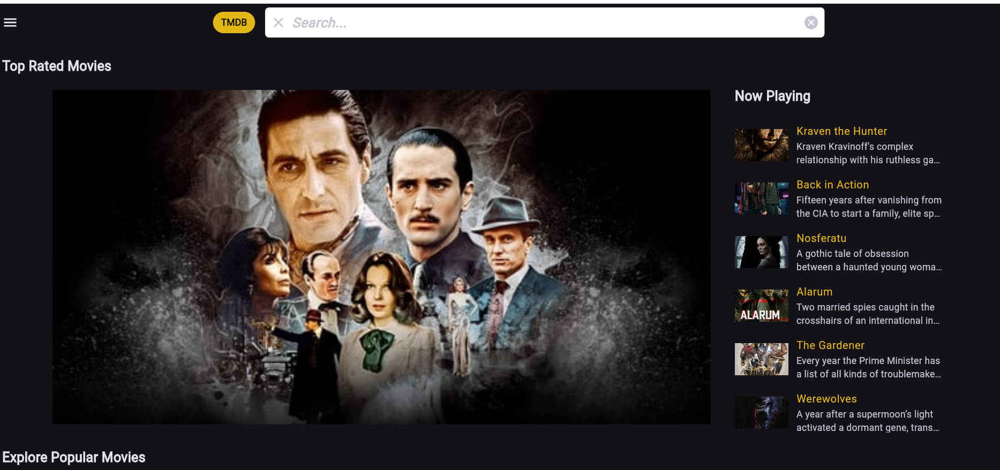

# Hi, I'm Sreenu Chandaka 👋
**Innovative Full-Stack Architect** | **Cloud-Native Solutions Developer** | **AI Integration Specialist**

[](https://www.linkedin.com/in/sreenuchandaka/)
[](https://sreenu-chandaka.github.io/my_portfolio/)
[](mailto:chandakasreenu0@gmail.com)

**Driving Digital Transformation Through**  
**Full-Stack Excellence & Intelligent Systems**


# 🛠️ **Technical Arsenal**

| **Category**            | **Technologies**                          |
|--------------------------|-------------------------------------------|
| **Backend Engineering**  | 🖥️ Spring Boot, Node.js                   |
| **Frontend Ecosystems**  | 🎨 React, Flutter                         |
| **Cloud Infrastructure** | ☁️ AWS, Docker, Kubernetes                |
| **AI/ML Integration**    | 🤖 TensorFlow, PyTorch                    |
| **DevOps & CI/CD**       | ⚙️ GitHub Actions                         |
| **Databases**            | 🗃️ PostgreSQL, Redis                     |

---

### 🚀 **Featured Innovations**  
<div align="center">  
  <a href="https://github.com/Sreenu-Chandaka/movie_web_app">  
      
  </a>  
  <a href="REPO2_URL">  
      
  </a>  
  
</div>  

---

### 📈 **Engineering Impact**  
```text
𝙇𝙖𝙩𝙚𝙨𝙩 𝘿𝙚𝙫𝙚𝙡𝙤𝙥𝙢𝙚𝙣𝙩 𝙏𝙧𝙚𝙣𝙙𝙨  
Flutter         🌟🌟🌟🌟🌟⟫░░░░░░░░░░ 90.5% 
Spring Boot     🌟🌟🌟🌟🌟⟫░░░░░░░░░░ 85.5%  
React           🌟🌟🌟🌟⟫░░░░░░░░░░░ 78.2%  
Cloud Native    🌟🌟🌟🌟⟫░░░░░░░░░░░ 82.1%  
AI Integration  🌟🌟🌟🌟⟫░░░░░░░░░░░ 76.8%  
```


### 🤝 **Collaborative Innovation**  
**Let's Engineer Tomorrow's Solutions Today**  
🌐 Explore my [Portfolio Website](https://sreenu-chandaka.github.io/my_portfolio/)  
📬 Reach out via [Email](mailto:chandakasreenu0@gmail.com) or [LinkedIn](https://www.linkedin.com/in/sreenuchandaka/)  
💡 Let's discuss AI-driven architectures or cloud-native transformations!  

---

# 🌟 **𝙊𝙥𝙚𝙣 𝙛𝙤𝙧 𝙎𝙩𝙧𝙖𝙩𝙚𝙜𝙞𝙘 𝘾𝙤𝙡𝙡𝙖𝙗𝙤𝙧𝙖𝙩𝙞𝙤𝙣 𝙞𝙣:**  

### 🚀 **Enterprise-scale Digital Transformations**  
- Modernize legacy systems and drive innovation at scale.  
- Deliver seamless, end-to-end digital experiences.  

### 🤖 **AI-Powered Application Development**  
- Build intelligent applications with cutting-edge AI/ML technologies.  
- Enhance decision-making and automate complex workflows.  

### ☁️ **Cloud Infrastructure Modernization**  
- Migrate, optimize, and scale with robust cloud solutions.  
- Leverage AWS, Docker, and Kubernetes for agility and efficiency.  

### 📱 **Cross-Platform Mobile Innovations**  
- Create stunning, high-performance mobile apps with Flutter.  
- Ensure seamless experiences across iOS, Android, and web.  

---

✨ **Let’s collaborate to shape the future of technology!** ✨

---

**"The art of engineering lies in transforming complex challenges into elegant solutions."**  
*- Sreenu Chandaka*  

---
